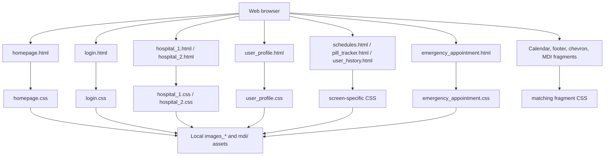

# QuickCare

QuickCare is a healthcare service interface prototype for discovering hospitals, booking appointments, tracking medication, viewing schedules, managing a patient profile, and accessing emergency care.

The repository contains a collection of static screens exported from a Figma design. It is intentionally a front-end prototype: the screens demonstrate the intended user experience and visual system, but there is currently no JavaScript application logic, API, database, authentication service, or server-side implementation.

## Highlights

- Healthcare landing page with hospital search, feature areas, testimonials, locations, and footer content.
- Login and registration-oriented screen with social sign-in visuals.
- Hospital detail and appointment-booking screens.
- Patient profile with doctor availability and medical information.
- Appointment schedule and calendar views.
- Medication/pill tracker view.
- Medical history view showing doctors, medications, and hospitals visited.
- Emergency appointment/video-call interface.
- Reusable visual fragments for calendar dates, chevrons, appointment speciality choices, footer columns, and Material Design icon samples.

## Technology Stack

| Technology | How it is used | Why it is used |
| --- | --- | --- |
| HTML5 | Semantic document structure for each screen | Provides a simple, browser-native foundation that is easy to inspect, share, and convert into a functional application later. |
| CSS3 | Layout, typography, colors, spacing, shadows, borders, responsive breakpoints, and component styling | Keeps presentation separate from markup and makes the static prototype runnable without a build step. |
| CSS Flexbox | Alignment and grouping of controls, cards, lists, and navigation fragments | Supports the exported layouts and provides basic flexible positioning. |
| CSS media queries | Breakpoint-specific sizing rules, mainly around `1440px` and `768px` | Allows the exported screens to adapt to smaller viewport sizes. |
| SVG | Icons, decorative shapes, social logos, calendar controls, and status indicators | Preserves sharp vector visuals at different sizes and keeps design assets local. |
| PNG/JPG image assets | Illustrations, profile images, hospital imagery, and decorative artwork | Supplies the visual content used by the Figma designs. |
| Google Fonts | Inter, Roboto, Montserrat, and Poppins loaded from Google Fonts | Matches the typography specified by the original designs. |
| Figma export workflow | The naming and structure of the generated markup and CSS | Explains the screen-oriented files and the generated class names such as `frame-*`, `group-*`, and `text-*`. |

### Technologies not currently present

- No JavaScript or TypeScript files.
- No React, Vue, Angular, or other UI framework.
- No npm project, bundler, build pipeline, or package manager configuration.
- No REST/GraphQL API integration or external data fetching.
- No database, authentication provider, or real-time video service.

## Project Architecture

The project uses a **multi-page static screen architecture**. Each major screen is a direct HTML entry point paired with a stylesheet of the same base name. Images and SVGs are grouped by screen in local asset directories.



### Request/render pipeline

1. The browser opens one of the standalone `.html` files.
2. The page loads its matching `.css` stylesheet.
3. The stylesheet applies generated layout rules, typography, colors, and responsive rules.
4. The page loads local SVG/PNG assets from its corresponding `images_*` directory.
5. The browser renders the screen entirely on the client; there is no runtime data or server request required for the prototype.

## Directory and File Guide

### Main screens

| Screen | Entry point | Purpose |
| --- | --- | --- |
| Homepage | `homepage.html` | Product overview, hospital discovery, features, testimonials, locations, and footer. |
| Login | `login.html` | Sign-in, registration, password recovery, and social-login presentation. |
| Hospital details | `hospital_1.html`, `hospital_2.html` | Hospital information, specialities, benefits, address, date, doctor, and appointment controls. |
| User profile | `user_profile.html` | Patient details, medical history, emergency contact, and assigned doctors. |
| User history | `user_history.html` | Previous doctors, medications, and visited hospitals. |
| Schedules | `schedules.html` | Calendar and appointment schedule view. |
| Pill tracker | `pill_tracker.html` | Calendar-based medication tracking view. |
| Emergency appointment | `emergency_appointment.html` | Emergency video-call layout, call controls, timer, and doctor list. |

### Supporting fragments and exports

- `calendar.html` and `calendar_2.html`: calendar/icon fragments.
- `frame30_1.html` and `frame_30_2.html`: calendar date-grid variants.
- `frame3_1.html` and `frame3_2.html`: speciality-selection fragments.
- `chevron_right1.html` through `chevron_right4.html`: chevron icon fragments.
- `footer_column1.html` through `footer_column4.html`: footer column fragments.
- `8px.html`, `mdi.html`, and `mdi_2.html`: small exported design/icon samples.
- Every HTML entry point has a matching `.css` file in the repository.

## How to Run Locally

Because this is a static website, no dependency installation or build command is required.

### Option 1: Open directly

Open `homepage.html` in a browser, then open the other screen files as needed.

### Option 2: Use a local static server

From the project directory, run any static server. For example, with Python:

```bash
python -m http.server 8000
```

Then visit:

```text
http://localhost:8000/homepage.html
```

Serving the folder over HTTP is useful because it mirrors deployment behavior and avoids browser restrictions that can affect local asset loading.

## Design and Implementation Notes

- The HTML/CSS naming is largely generated by a Figma-to-code export, which is why many classes have names such as `rectangle-*`, `group-*`, `node-*`, and `text-*`.
- Most content is represented as fixed screen data in the markup, including names, dates, hospital details, medication names, and testimonials.
- The stylesheets include reset rules, CSS custom properties for repeated colors and fonts, Flexbox declarations, and responsive media queries.
- Asset directories are separated by screen, reducing accidental cross-screen asset collisions and preserving the original design export structure.
- Some pages use remote Google Font imports, while several stylesheets also reference local font files under a `fonts/` path. The local font files should be added or the declarations removed if fully offline rendering is required.
- The current screens are visual representations. Labels such as “Book Appointment”, “Search”, “Sign In”, “End Call”, and calendar controls are not connected to event handlers yet.

## Current Limitations

This version should be presented as a **UI prototype**, not a production healthcare application.

- Forms are visual only; credentials are not submitted or validated.
- Login, registration, password recovery, booking, search, calendar navigation, logout, and call controls are not interactive.
- Data is hard-coded in HTML rather than loaded from a service.
- There is no authentication, authorization, encryption, audit trail, or protected health-information handling.
- There are no automated tests, linting rules, accessibility checks, or CI configuration.
- The Figma-generated markup has limited semantic structure and would need refactoring before production use.

## Recommended Next Development Phase

1. Refactor repeated markup into reusable components and improve semantic HTML and accessibility.
2. Add a JavaScript or TypeScript application layer for form state, navigation, validation, calendar actions, search, and appointment booking.
3. Introduce a backend API with authentication and role-based access for patients, doctors, and hospital staff.
4. Store appointments, medication schedules, doctors, hospitals, and history in a database.
5. Replace placeholder data with API-driven state and add loading, empty, error, and success states.
6. Add security controls appropriate for healthcare data, including access control, secure sessions, encryption, audit logging, and privacy review.
7. Add unit, integration, accessibility, and end-to-end tests, followed by a CI/CD deployment pipeline.

## Interview Talking Points

- **Why static HTML/CSS?** The goal of this iteration was to validate the healthcare workflow and visual design quickly from Figma without introducing a build or backend dependency.
- **What is the architecture?** It is a multi-page static prototype with one HTML/CSS pair per screen and screen-specific local assets.
- **How would you productionize it?** Extract reusable components, introduce typed application state, connect forms and screens to secured APIs, and add automated tests and deployment checks.
- **What is the main technical trade-off?** The export preserves visual fidelity and is easy to run, but generated class names, duplicated markup, hard-coded data, and absent behavior make it unsuitable as a maintainable production application without refactoring.
- **What would you prioritize first?** Authentication and authorization, semantic/accessibility improvements, reusable components, and a clear domain model for appointments, medication, doctors, hospitals, and patient history.

## License

No license file is currently included. Add a license before publishing the repository for reuse.